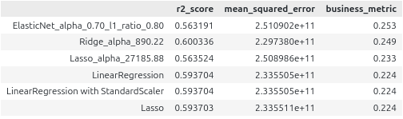

# Домашнее задание 1

В этом домашнем задании требовалось предсказывать стоимость автомобилей.

## Этапы

- изучили датасет с характеристиками автомобилей
- предобработали данные:
	- удалили дубликаты
	- заполнили пропуски средними значениями
	- очистили данные (удалили размерности, оставив численные значения)
- сделали визуализации данных, смотрели на корреляции между признаками
- обучали линейные модели:
	- только на численных значениях
	- вместе с категориальными признаками
- предсказывали стоимость автомобилей

## Линейные модели

Рассмотрели следующие модели:
- LinearRegression (линейная регрессия)
- Lasso (L1-регуляризация)
- Ridge (L2-регуляризация)
- ElasticNet (L1- и L2-регуляризации)

Для подбора гиперпараметров использовали GridSearchCV

## Метрики

- r2_score
- mean_squared_error
- доля прогнозов, отличающихся от реальных цен не более чем на 10% (бизнес-метрика)

## Streamlit

В приложении реализована работа модели ElasticNet с параметрами, подобранными по GridSearch в процессе выполнения домашнего задания. Модель работает только на признаках *year*, *km_driven*, *mileage*, *engine*, *max_power*, *seats*.

Для предсказания стоимости автомобилей с помощью csv-файла, требуется использовать файл с предобработанными данными. Для этого можно использовать data/cars_test_processed.csv

Приложение доступно по ссылке: https://hse-ai25-maksim-aleksyuk-hw1.streamlit.app/

## Итоги

В данной работе применяли линейные модели к данным по автомобилям для предсказания их стоимости. Данные содержали как численные значения, так и категориальные. Для обучения пробовали варианты обучения только на численных значениях, а затем на численных и категориальных. Данные масштабировали, используя StandardScaler.

На рисунке ниже представлены метрики по рассмотренным моделям. Модель ElasticNet показала лучшее значение бизнес-метрики. Будем считать эту модель приоритетной, поэтому она используется в приложении на базе Streamlit. Лучшее значение метрики $R^2$ показвыает модель Rodge. Применение масштабирования к данным на модели LinearRegression не изменило значения метрик.

Кажется, что в целом полученные значения странные. Судя по $R^2$, модели предсказывают всего немного лучше, чем просто выдавая среднее значение. По MSE ничего непонятно, её значения слишком большие, и я не понимаю, как их интерпретировать. Значения бизнес-метрики говорят, что только в 22-25% случаев предсказанные значения могут удовлетворить заказчика. Хотелось бы улучшить метрики. Один из возможных путей - добавить полиномиальные признаки. Также в работе был исключён один из признаков, можно его аккуратно обработать и использовать при обучении моделей.
